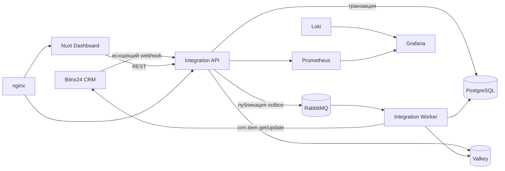

# 02. Архитектура

Границы ответственности:

- Bitrix24 хранит CRM-процесс, клиентов, коммерческие поля, задачи и согласования.
- PostgreSQL — источник истины для транспорта, рейсов и истории интеграции.
- Redis/Valkey хранит только временные ключи идемпотентности и распределённые блокировки.
- RabbitMQ отделяет быстрый ответ webhook от внешних вызовов. Publisher confirms и ручной `ack`
  защищают от незаметной потери, а retry queue и DLQ сохраняют ошибки.
- API записывает outbox в той же транзакции, что и доменное изменение; dispatcher повторяет
  публикацию незавершённых событий.
- На всём пути используется один UUID `correlationId`.

Публичный webhook считается недоверенным. Секреты нельзя логировать. В production нужны TLS,
сильные пароли, сетевые ограничения и отдельная аутентификация пользовательского API.
